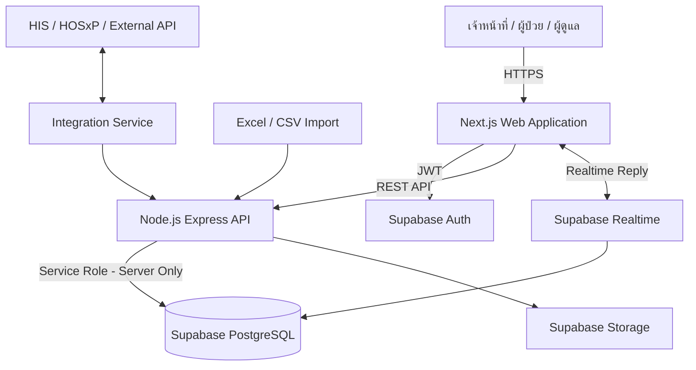
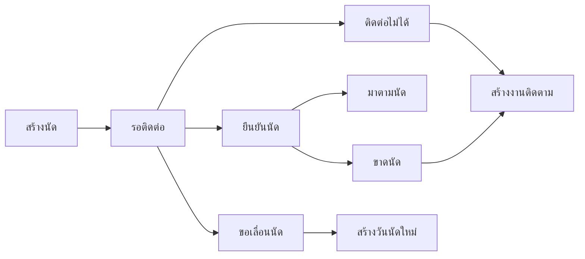
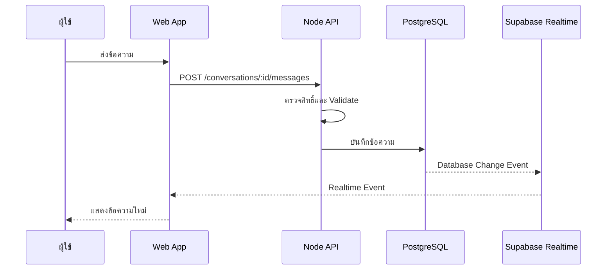
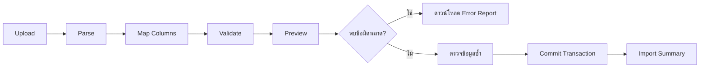
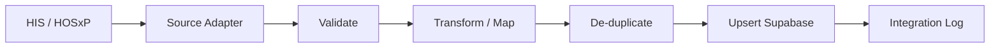

# KHH Safe-Connect

> ระบบดูแล ติดตาม และสื่อสารกับผู้ป่วยโรคไม่ติดต่อเรื้อรัง (NCDs)

**KHH Safe-Connect** เป็นเว็บแอปพลิเคชันสำหรับบริหารข้อมูลผู้ป่วย NCDs รายการนัดหมาย งานติดตาม การติดต่อผู้ป่วย การให้คำแนะนำด้านการปฏิบัติตัว และการสื่อสารแบบ **Reply** ระหว่างผู้ป่วยกับเจ้าหน้าที่

ระบบออกแบบให้เริ่มจากการนำเข้าข้อมูลผ่าน Excel/CSV และสามารถขยายไปเชื่อมต่อฐานข้อมูลจริงของโรงพยาบาล เช่น HIS หรือ HOSxP ผ่าน Integration API ในอนาคต

---

## สารบัญ

1. [เป้าหมายของระบบ](#เป้าหมายของระบบ)
2. [ขอบเขตผู้ป่วย](#ขอบเขตผู้ป่วย)
3. [คุณสมบัติหลัก](#คุณสมบัติหลัก)
4. [บทบาทผู้ใช้งาน](#บทบาทผู้ใช้งาน)
5. [Technology Stack](#technology-stack)
6. [System Architecture](#system-architecture)
7. [โครงสร้างโปรเจกต์](#โครงสร้างโปรเจกต์)
8. [โมดูลของระบบ](#โมดูลของระบบ)
9. [โครงสร้างฐานข้อมูล](#โครงสร้างฐานข้อมูล)
10. [สถานะมาตรฐาน](#สถานะมาตรฐาน)
11. [Reply และ Supabase Realtime](#reply-และ-supabase-realtime)
12. [API Design](#api-design)
13. [การติดตั้งและใช้งาน](#การติดตั้งและใช้งาน)
14. [Environment Variables](#environment-variables)
15. [การตั้งค่า Supabase](#การตั้งค่า-supabase)
16. [สิทธิ์และความปลอดภัย](#สิทธิ์และความปลอดภัย)
17. [Audit Log](#audit-log)
18. [การนำเข้าข้อมูล Excel](#การนำเข้าข้อมูล-excel)
19. [การเชื่อม HIS/HOSxP ในอนาคต](#การเชื่อม-hishosxp-ในอนาคต)
20. [การทดสอบ](#การทดสอบ)
21. [Deployment](#deployment)
22. [MVP Acceptance Criteria](#mvp-acceptance-criteria)
23. [Roadmap](#roadmap)
24. [ข้อควรระวังทางคลินิก](#ข้อควรระวังทางคลินิก)

---

## เป้าหมายของระบบ

KHH Safe-Connect มีเป้าหมายเพื่อช่วยให้หน่วยบริการสามารถดูแลผู้ป่วย NCDs ได้ต่อเนื่อง โดยลดปัญหาผู้ป่วยขาดนัด ติดต่อไม่ได้ ได้รับคำแนะนำไม่ครบถ้วน หรือไม่มีช่องทางสื่อสารกับเจ้าหน้าที่อย่างเป็นระบบ

ระบบต้องตอบคำถามสำคัญได้ เช่น

- วันนี้มีผู้ป่วย NCDs นัดกี่ราย
- ผู้ป่วยคนใดยืนยันนัดแล้ว
- ผู้ป่วยคนใดขาดนัดหรือติดต่อไม่ได้
- เจ้าหน้าที่คนใดรับผิดชอบงานติดตาม
- ผู้ป่วยได้รับคำแนะนำเรื่องอาหาร ความเครียด และยาแล้วหรือไม่
- ผู้ป่วยส่งข้อความสอบถามเรื่องใด
- ข้อความใดเร่งด่วนและต้องส่งต่อ
- ข้อมูลผู้ป่วยมาจากระบบใดและซิงก์ล่าสุดเมื่อใด

---

## ขอบเขตผู้ป่วย

ระบบรุ่นแรกครอบคลุมผู้ป่วยโรคไม่ติดต่อเรื้อรังดังต่อไปนี้

| รหัส | กลุ่มโรค |
|---|---|
| `DM` | เบาหวาน |
| `HT` | ความดันโลหิตสูง |
| `CKD` | โรคไตเรื้อรัง |
| `COPD` | โรคปอดอุดกั้นเรื้อรัง |
| `ASTHMA` | โรคหืด |

ผู้ป่วยหนึ่งรายสามารถมีหลายโรคร่วมกันได้ เช่น `DM + HT + CKD Stage 3`

ระบบต้องไม่จัดเก็บโรคทั้งหมดเป็นข้อความก้อนเดียว แต่ใช้ความสัมพันธ์ระหว่าง `patients`, `disease_master` และ `patient_diseases` เพื่อให้ค้นหา กรอง วิเคราะห์ และจัดทำรายงานได้ถูกต้อง

---

## คุณสมบัติหลัก

### 1. Dashboard

- จำนวนผู้ป่วยนัดวันนี้ พรุ่งนี้ และภายใน 7 วัน
- จำนวนผู้ป่วยรอยืนยันนัด
- จำนวนผู้ป่วยขาดนัด
- จำนวนงานติดตามที่ครบกำหนดหรือเกินกำหนด
- จำนวนข้อความ Reply ใหม่
- จำนวนข้อความเร่งด่วน
- สรุปผู้ป่วยแยกตามโรค
- สรุปภาระงานแยกตามเจ้าหน้าที่
- สถิติการมาตามนัดรายเดือน

### 2. ทะเบียนผู้ป่วย NCDs

- HN และรหัสผู้ป่วยจากระบบภายนอก
- ชื่อ นามสกุล วันเกิด อายุ และเพศ
- ที่อยู่ผู้ป่วย
- เบอร์โทรศัพท์หลักและสำรอง
- ผู้ดูแลหรือญาติ
- ช่องทางและเวลาที่สะดวกให้ติดต่อ
- การยินยอมให้ติดต่อ
- โรคประจำตัวและระดับของโรค
- สถานะผู้ป่วย

### 3. รายการนัดหมาย

- รายการนัดรายวัน รายสัปดาห์ และรายเดือน
- ค้นหาและกรองตามโรค คลินิก สถานะ หรือเจ้าหน้าที่
- ยืนยันนัด
- เลื่อนนัด
- ยกเลิกนัด
- ระบุผู้ป่วยมาตามนัดหรือขาดนัด
- สร้างงานติดตามจากรายการนัด
- เก็บประวัติการเปลี่ยนแปลงสถานะนัด

### 4. งานติดตาม

- โทรยืนยันนัด
- โทรติดตามผู้ป่วยขาดนัด
- ตรวจสอบหมายเลขโทรศัพท์
- ติดตามการใช้ยา
- ติดตามการปฏิบัติตัว
- กำหนดผู้รับผิดชอบ วันครบกำหนด และระดับความสำคัญ
- บันทึกผลและวันติดตามครั้งถัดไป

### 5. บันทึกการติดต่อ

- วันที่และเวลาติดต่อ
- ช่องทางการติดต่อ
- บุคคลที่รับสาย
- ผลการติดต่อ
- สรุปการสนทนา
- คำแนะนำที่ให้
- ปัญหาที่ผู้ป่วยแจ้ง
- วันที่ควรติดตามครั้งถัดไป
- เจ้าหน้าที่ผู้ติดต่อ

### 6. Reply

- Inbox ของเจ้าหน้าที่
- สนทนาแบบเรียลไทม์ผ่าน Supabase Realtime
- รองรับผู้ป่วย ผู้ดูแล และเจ้าหน้าที่
- แสดงสถานะอ่านแล้วหรือยังไม่อ่าน
- มอบหมายเรื่องให้เจ้าหน้าที่
- ส่งต่อเรื่องไปยังหน่วยงานหรือวิชาชีพที่เกี่ยวข้อง
- ข้อความสำเร็จรูป
- แนบรูปภาพหรือเอกสาร
- บันทึกข้อความภายในสำหรับเจ้าหน้าที่
- ปิดเรื่องเมื่อดำเนินการเรียบร้อย

### 7. คำแนะนำการปฏิบัติตัว

แบ่งเป็น 3 หมวดหลัก

- การรับประทานอาหาร
- ความเครียดและการนอน
- การใช้ยา

ระบบบันทึกได้ว่าใครเป็นผู้ให้คำแนะนำ ให้เมื่อใด ผู้ป่วยเข้าใจหรือไม่ มีข้อจำกัดอะไร และต้องติดตามเรื่องใดต่อ

### 8. Patient Timeline

รวมเหตุการณ์ของผู้ป่วยไว้ในหน้าเดียว เช่น

- สร้างหรือแก้ไขข้อมูลผู้ป่วย
- นัดหมาย
- เปลี่ยนสถานะนัด
- การติดต่อ
- Reply
- คำแนะนำ
- งานติดตาม
- การนำเข้าหรือซิงก์ข้อมูล

### 9. รายงาน

- รายงานผู้ป่วยนัด
- รายงานผู้ป่วยขาดนัด
- รายงานติดต่อไม่ได้
- รายงานการติดตาม
- รายงาน Reply
- รายงานคำแนะนำสุขภาพ
- รายงานภาระงานเจ้าหน้าที่
- Export เป็น Excel/CSV
- PDF สำหรับรายงานที่กำหนด

### 10. นำเข้าข้อมูล

- นำเข้า Excel/CSV
- จับคู่คอลัมน์
- ตรวจสอบความถูกต้องก่อนบันทึก
- แสดงแถวที่ผิดพลาด
- ป้องกันข้อมูลซ้ำ
- บันทึกประวัติการนำเข้า

---

## บทบาทผู้ใช้งาน

| บทบาท | สิทธิ์หลัก |
|---|---|
| `super_admin` | จัดการระบบ องค์กร และค่ากลางทั้งหมด |
| `hospital_admin` | จัดการผู้ใช้ คลินิก และข้อมูลภายในหน่วยงาน |
| `ncd_coordinator` | ดูภาพรวม มอบหมายงาน และตรวจสอบผลติดตาม |
| `doctor` | ดูข้อมูลทางคลินิกและประวัติการติดตามตามสิทธิ์ |
| `nurse` | จัดการนัด ติดต่อ ติดตาม และบันทึกคำแนะนำ |
| `pharmacist` | ดูและบันทึกข้อมูลด้านยาและปัญหาการใช้ยา |
| `call_center` | เข้าถึงข้อมูลที่จำเป็นต่อการติดต่อเท่านั้น |
| `auditor` | อ่านรายงานและ Audit Log โดยแก้ไขไม่ได้ |
| `patient` | ดูข้อมูลของตนเอง นัดหมาย และ Reply ในระยะต่อไป |
| `caregiver` | ติดต่อแทนผู้ป่วยตามสิทธิ์และความยินยอม |

ใช้หลัก **Least Privilege** ผู้ใช้งานแต่ละบทบาทต้องเห็นเฉพาะข้อมูลที่จำเป็นต่อการทำงาน

---

## Technology Stack

### Frontend

- Next.js
- React
- TypeScript
- Tailwind CSS
- React Hook Form
- Zod
- TanStack Query
- Supabase JavaScript Client

### Backend

- Node.js
- Express.js
- TypeScript
- Zod หรือ Joi สำหรับ Validation
- Supabase Admin Client
- Multer หรือ Signed Upload URL สำหรับไฟล์
- ExcelJS หรือ SheetJS สำหรับนำเข้าและส่งออก Excel

### Database และบริการหลัก

- Supabase PostgreSQL
- Supabase Auth
- Supabase Realtime
- Supabase Storage
- Supabase Row Level Security

### Development และ Deployment

- npm หรือ pnpm
- ESLint
- Prettier
- Vitest หรือ Jest
- Playwright
- Docker
- GitHub Actions หรือระบบ CI/CD ที่หน่วยงานกำหนด

> โครงการนี้ใช้ **Supabase Realtime สำหรับ Reply** และไม่จำเป็นต้องใช้ Firebase ในขอบเขต MVP

---

## System Architecture



### หลักการสำคัญ

1. Frontend ไม่เชื่อมฐานข้อมูลโรงพยาบาลโดยตรง
2. `SUPABASE_SERVICE_ROLE_KEY` ใช้เฉพาะฝั่ง Server
3. Supabase เป็นแหล่งข้อมูลหลักของ KHH Safe-Connect
4. ข้อมูลจาก HIS/HOSxP ผ่าน Integration Layer ก่อนบันทึก
5. Reply ใช้ Supabase Realtime แต่ข้อมูลข้อความยังถูกบันทึกใน PostgreSQL
6. การเปลี่ยนแปลงข้อมูลสำคัญต้องสร้าง Audit Log

---

## โครงสร้างโปรเจกต์

```text
khh-safe-connect/
├── apps/
│   ├── web/
│   │   ├── app/
│   │   │   ├── (auth)/
│   │   │   ├── dashboard/
│   │   │   ├── patients/
│   │   │   ├── appointments/
│   │   │   ├── follow-ups/
│   │   │   ├── reply/
│   │   │   ├── education/
│   │   │   ├── reports/
│   │   │   ├── imports/
│   │   │   └── settings/
│   │   ├── components/
│   │   ├── features/
│   │   ├── hooks/
│   │   ├── lib/
│   │   ├── types/
│   │   └── middleware.ts
│   │
│   └── api/
│       ├── src/
│       │   ├── app.ts
│       │   ├── server.ts
│       │   ├── config/
│       │   ├── middleware/
│       │   ├── guards/
│       │   ├── modules/
│       │   │   ├── auth/
│       │   │   ├── organizations/
│       │   │   ├── users/
│       │   │   ├── patients/
│       │   │   ├── diseases/
│       │   │   ├── appointments/
│       │   │   ├── follow-ups/
│       │   │   ├── contacts/
│       │   │   ├── conversations/
│       │   │   ├── messages/
│       │   │   ├── education/
│       │   │   ├── reports/
│       │   │   ├── imports/
│       │   │   ├── audit/
│       │   │   └── integrations/
│       │   ├── shared/
│       │   └── types/
│       └── tests/
│
├── packages/
│   ├── ui/
│   ├── types/
│   ├── validation/
│   └── config/
│
├── supabase/
│   ├── migrations/
│   ├── policies/
│   ├── functions/
│   ├── seed.sql
│   └── config.toml
│
├── docs/
│   ├── architecture.md
│   ├── database.md
│   ├── api.md
│   ├── security.md
│   ├── import-template.md
│   └── integration.md
│
├── scripts/
│   ├── seed.ts
│   ├── create-admin.ts
│   └── validate-import.ts
│
├── .env.example
├── docker-compose.yml
├── package.json
├── pnpm-workspace.yaml
└── README.md
```

---

## โมดูลของระบบ

### Dashboard Module

หน้าสรุปสำหรับเจ้าหน้าที่และผู้ประสานงาน NCDs

**ตัวกรองหลัก**

- วันที่
- คลินิก
- กลุ่มโรค
- เจ้าหน้าที่
- สถานะนัด
- ระดับความเสี่ยง

### Patient Module

ข้อมูลสำคัญ

- ข้อมูลระบุตัว
- ที่อยู่
- ช่องทางติดต่อ
- ผู้ดูแล
- โรคประจำตัว
- การยินยอม
- Timeline

### Appointment Module

รองรับ Workflow



### Follow-up Module

งานติดตามประกอบด้วย

- ประเภทงาน
- หัวข้อ
- รายละเอียด
- ผู้รับผิดชอบ
- ความสำคัญ
- วันครบกำหนด
- สถานะ
- ผลลัพธ์
- วันติดตามครั้งต่อไป

### Reply Module

รองรับหัวข้อ เช่น

- ขอเลื่อนนัด
- สอบถามวันนัด
- สอบถามการใช้ยา
- แจ้งอาการผิดปกติ
- สอบถามการปฏิบัติตัว
- แจ้งเปลี่ยนที่อยู่หรือเบอร์โทรศัพท์
- สอบถามเอกสาร
- เรื่องทั่วไป

### Education Module

บันทึกคำแนะนำ 3 หมวด

1. อาหาร
2. ความเครียด
3. ยา

### Report Module

ผู้ใช้งานเลือกช่วงเวลา คลินิก กลุ่มโรค สถานะ และเจ้าหน้าที่ก่อน Export ได้

### Import Module

รองรับ Preview, Validation, Duplicate Detection, Commit และ Rollback ตาม Batch

### Integration Module

รองรับการเชื่อมต่อผ่าน

- REST API
- Read-only Database View
- CSV/Excel
- HL7 v2
- FHIR
- Message Queue ในอนาคต

---

## โครงสร้างฐานข้อมูล

ทุกตารางหลักควรมีอย่างน้อย

```text
id UUID PRIMARY KEY
organization_id UUID
created_at TIMESTAMPTZ
updated_at TIMESTAMPTZ
created_by UUID
updated_by UUID
```

### 1. องค์กรและผู้ใช้งาน

#### `organizations`

- `id`
- `code`
- `name`
- `organization_type`
- `phone`
- `address`
- `is_active`

#### `profiles`

- `id` อ้างอิง Supabase Auth User ID
- `organization_id`
- `employee_code`
- `full_name`
- `phone`
- `role`
- `is_active`
- `last_login_at`

#### `clinics`

- `id`
- `organization_id`
- `code`
- `name`
- `phone`
- `is_active`

### 2. ผู้ป่วย

#### `patients`

- `id`
- `organization_id`
- `hn`
- `cid_encrypted` หรือข้อมูลที่ได้รับการป้องกันตามนโยบาย
- `external_patient_id`
- `source_system`
- `title`
- `first_name`
- `last_name`
- `date_of_birth`
- `gender`
- `phone_primary`
- `phone_secondary`
- `line_id`
- `preferred_contact_method`
- `preferred_contact_time`
- `contact_consent`
- `patient_status`
- `last_synced_at`

**ข้อกำหนด**

- `hn` ต้อง Unique ภายในองค์กร
- `external_patient_id + source_system` ควร Unique เมื่อมีค่า
- ห้ามใช้เลขบัตรประชาชนเป็น Primary Key

#### `patient_addresses`

- `patient_id`
- `address_type`
- `house_number`
- `village_number`
- `road`
- `subdistrict`
- `district`
- `province`
- `postal_code`
- `landmark`
- `latitude`
- `longitude`
- `is_primary`

#### `patient_caregivers`

- `patient_id`
- `full_name`
- `relationship`
- `phone`
- `address`
- `is_primary`
- `contact_consent`

### 3. โรค

#### `disease_master`

- `code`
- `name_th`
- `name_en`
- `is_active`

#### `patient_diseases`

- `patient_id`
- `disease_id`
- `diagnosed_at`
- `disease_stage`
- `status`
- `clinic_id`
- `notes`

### 4. นัดหมาย

#### `appointments`

- `patient_id`
- `clinic_id`
- `appointment_date`
- `appointment_time`
- `appointment_type`
- `room`
- `provider_name`
- `status`
- `reason`
- `notes`
- `external_appointment_id`
- `source_system`
- `last_synced_at`

#### `appointment_status_history`

- `appointment_id`
- `previous_status`
- `new_status`
- `reason`
- `changed_by`
- `changed_at`

### 5. งานติดตามและการติดต่อ

#### `follow_up_tasks`

- `patient_id`
- `appointment_id`
- `task_type`
- `title`
- `description`
- `assigned_to`
- `priority`
- `status`
- `due_at`
- `completed_at`
- `result`
- `next_follow_up_at`

#### `contact_logs`

- `patient_id`
- `appointment_id`
- `staff_id`
- `contact_method`
- `contacted_at`
- `contact_result`
- `receiver_name`
- `conversation_summary`
- `advice_given`
- `next_contact_at`

### 6. Reply

#### `conversations`

- `patient_id`
- `appointment_id`
- `subject`
- `category`
- `priority`
- `status`
- `assigned_to`
- `opened_at`
- `resolved_at`
- `closed_at`

#### `conversation_members`

- `conversation_id`
- `member_type`
- `staff_id`
- `patient_id`
- `caregiver_id`
- `joined_at`
- `left_at`

#### `messages`

- `conversation_id`
- `sender_type`
- `sender_staff_id`
- `sender_patient_id`
- `sender_caregiver_id`
- `message_type`
- `message_text`
- `reply_to_message_id`
- `is_internal_note`
- `created_at`
- `edited_at`
- `deleted_at`

#### `message_attachments`

- `message_id`
- `file_name`
- `file_path`
- `mime_type`
- `file_size`
- `uploaded_by`

#### `message_reads`

- `message_id`
- `reader_type`
- `reader_id`
- `read_at`

#### `reply_templates`

- `template_name`
- `category`
- `template_text`
- `is_active`
- `created_by`

#### `conversation_assignments`

- `conversation_id`
- `assigned_from`
- `assigned_to`
- `reason`
- `assigned_at`

### 7. การให้คำแนะนำ

#### `education_topics`

- `category`
- `code`
- `title`
- `content`
- `is_active`

#### `patient_education_logs`

- `patient_id`
- `topic_id`
- `appointment_id`
- `provided_by`
- `provided_at`
- `understanding_level`
- `patient_barrier`
- `goal`
- `follow_up_at`
- `notes`

### 8. การนำเข้าและเชื่อมระบบ

#### `import_batches`

- `file_name`
- `file_path`
- `import_type`
- `status`
- `total_rows`
- `success_rows`
- `failed_rows`
- `started_at`
- `completed_at`
- `uploaded_by`

#### `import_errors`

- `batch_id`
- `row_number`
- `column_name`
- `error_code`
- `error_message`
- `raw_data`

#### `integration_logs`

- `source_system`
- `operation`
- `external_reference`
- `status`
- `request_id`
- `error_message`
- `started_at`
- `completed_at`

### 9. ความปลอดภัยและการตรวจสอบ

#### `consent_records`

- `patient_id`
- `consent_type`
- `status`
- `channel`
- `granted_at`
- `revoked_at`
- `recorded_by`
- `evidence_path`

#### `audit_logs`

- `organization_id`
- `actor_id`
- `actor_role`
- `action`
- `entity_type`
- `entity_id`
- `old_values`
- `new_values`
- `ip_address`
- `user_agent`
- `request_id`
- `created_at`

---

## ดัชนีฐานข้อมูลที่แนะนำ

```sql
CREATE INDEX idx_patients_org_hn
ON patients (organization_id, hn);

CREATE INDEX idx_patients_name
ON patients (organization_id, first_name, last_name);

CREATE INDEX idx_appointments_date_status
ON appointments (organization_id, appointment_date, status);

CREATE INDEX idx_followups_assignee_due
ON follow_up_tasks (organization_id, assigned_to, status, due_at);

CREATE INDEX idx_conversations_assignee_status
ON conversations (organization_id, assigned_to, status, updated_at DESC);

CREATE INDEX idx_messages_conversation_created
ON messages (conversation_id, created_at);

CREATE INDEX idx_audit_entity
ON audit_logs (organization_id, entity_type, entity_id, created_at DESC);
```

---

## สถานะมาตรฐาน

### Appointment Status

```text
scheduled
pending_contact
confirmed
reschedule_request
rescheduled
arrived
completed
missed
cancelled
referred
```

### Follow-up Status

```text
todo
in_progress
waiting_patient
completed
cancelled
overdue
```

### Conversation Status

```text
new
assigned
in_progress
waiting_patient
waiting_staff
escalated
resolved
closed
```

### Priority

```text
low
normal
high
urgent
```

### Contact Result

```text
confirmed
caregiver_answered
no_answer
phone_off
invalid_number
reschedule_requested
treated_elsewhere
moved
refused_contact
deceased
other
```

ควรสร้างค่าคงที่ร่วมกันใน `packages/types` เพื่อป้องกัน Frontend และ Backend ใช้ค่าไม่ตรงกัน

---

## Reply และ Supabase Realtime

### Data Flow



### Channel Naming

```text
conversation:<conversation_id>
user:<profile_id>
organization:<organization_id>:reply
```

ห้ามใช้ชื่อผู้ป่วย HN หรือข้อมูลสุขภาพเป็นชื่อ Channel

### การ Subscribe

Frontend ต้อง Subscribe เฉพาะบทสนทนาที่ผู้ใช้มีสิทธิ์เข้าถึง และต้องยกเลิก Subscription เมื่อออกจากหน้า

### Read Status

เมื่อผู้ใช้เปิดบทสนทนา

1. Frontend เรียก API เพื่อบันทึก `message_reads`
2. API ตรวจสอบ Membership และสิทธิ์
3. ระบบอัปเดตจำนวนข้อความที่ยังไม่อ่าน
4. Realtime ส่งสถานะให้คู่สนทนา

### Internal Note

ข้อความที่ `is_internal_note = true`

- แสดงเฉพาะเจ้าหน้าที่
- ผู้ป่วยและผู้ดูแลห้ามอ่าน
- ต้องมี RLS และ Backend Guard แยกจากข้อความทั่วไป

### Attachment

- ใช้ Private Bucket
- จำกัดชนิดไฟล์
- จำกัดขนาดไฟล์
- ตรวจสอบชื่อและนามสกุล
- ใช้ Signed URL อายุสั้น
- ไม่เปิด Public URL

ตัวอย่างชนิดไฟล์ที่อนุญาตใน MVP

```text
image/jpeg
image/png
application/pdf
```

---

## การคัดกรองข้อความเร่งด่วน

ระบบสามารถตรวจคำสำคัญเพื่อสร้าง Flag ให้เจ้าหน้าที่ แต่ต้องไม่วินิจฉัยหรือรักษาอัตโนมัติ

ตัวอย่างคำสำคัญ

```text
หายใจไม่ออก
เจ็บหน้าอก
หมดสติ
ชัก
หน้ามืดรุนแรง
พูดไม่ชัด
แขนขาอ่อนแรง
แพ้ยา
บวมหน้า
เลือดออกมาก
```

เมื่อพบคำสำคัญ

1. ตั้ง Priority เป็น `urgent`
2. สร้าง Clinical Flag
3. แสดงข้อความเตือนว่า Reply ไม่ใช่ช่องทางฉุกเฉิน
4. มอบหมายหรือส่งต่อเจ้าหน้าที่ตาม Workflow
5. บันทึก Audit Log

> การตรวจคำสำคัญเป็นเพียงกลไกช่วยคัดกรอง ไม่ใช่การประเมินทางคลินิก

---

## API Design

Base URL

```text
/api/v1
```

### Authentication

```http
GET    /auth/me
POST   /auth/logout
POST   /auth/refresh
```

### Patients

```http
GET    /patients
POST   /patients
GET    /patients/:patientId
PATCH  /patients/:patientId
GET    /patients/:patientId/timeline
GET    /patients/:patientId/appointments
GET    /patients/:patientId/conversations
GET    /patients/:patientId/education
```

### Diseases

```http
GET    /diseases
POST   /patients/:patientId/diseases
PATCH  /patients/:patientId/diseases/:patientDiseaseId
DELETE /patients/:patientId/diseases/:patientDiseaseId
```

### Appointments

```http
GET    /appointments
POST   /appointments
GET    /appointments/:appointmentId
PATCH  /appointments/:appointmentId
POST   /appointments/:appointmentId/confirm
POST   /appointments/:appointmentId/reschedule
POST   /appointments/:appointmentId/arrive
POST   /appointments/:appointmentId/complete
POST   /appointments/:appointmentId/mark-missed
POST   /appointments/:appointmentId/cancel
GET    /appointments/:appointmentId/history
```

### Follow-ups

```http
GET    /follow-ups
POST   /follow-ups
GET    /follow-ups/:taskId
PATCH  /follow-ups/:taskId
POST   /follow-ups/:taskId/assign
POST   /follow-ups/:taskId/start
POST   /follow-ups/:taskId/complete
POST   /follow-ups/:taskId/cancel
```

### Contacts

```http
GET    /patients/:patientId/contact-logs
POST   /patients/:patientId/contact-logs
PATCH  /contact-logs/:contactLogId
```

### Reply

```http
GET    /conversations
POST   /conversations
GET    /conversations/:conversationId
PATCH  /conversations/:conversationId
GET    /conversations/:conversationId/messages
POST   /conversations/:conversationId/messages
POST   /conversations/:conversationId/read
POST   /conversations/:conversationId/assign
POST   /conversations/:conversationId/escalate
POST   /conversations/:conversationId/resolve
POST   /conversations/:conversationId/close
POST   /conversations/:conversationId/reopen
```

### Attachments

```http
POST   /conversations/:conversationId/attachments/sign-upload
GET    /attachments/:attachmentId/sign-download
DELETE /attachments/:attachmentId
```

### Education

```http
GET    /education/topics
POST   /patients/:patientId/education
PATCH  /education/logs/:educationLogId
```

### Reports

```http
GET    /reports/dashboard
GET    /reports/appointments
GET    /reports/missed-appointments
GET    /reports/follow-ups
GET    /reports/replies
GET    /reports/staff-workload
POST   /reports/export
```

### Imports

```http
POST   /imports/upload
POST   /imports/:batchId/preview
POST   /imports/:batchId/validate
POST   /imports/:batchId/commit
POST   /imports/:batchId/cancel
GET    /imports/:batchId
GET    /imports/:batchId/errors
```

### API Response Format

Success

```json
{
  "success": true,
  "data": {},
  "meta": {
    "requestId": "uuid"
  }
}
```

Error

```json
{
  "success": false,
  "error": {
    "code": "VALIDATION_ERROR",
    "message": "ข้อมูลไม่ถูกต้อง",
    "details": []
  },
  "meta": {
    "requestId": "uuid"
  }
}
```

### HTTP Status ที่ใช้

| Status | ความหมาย |
|---|---|
| `200` | สำเร็จ |
| `201` | สร้างข้อมูลสำเร็จ |
| `204` | สำเร็จและไม่มี Response Body |
| `400` | Request ไม่ถูกต้อง |
| `401` | ยังไม่ได้ยืนยันตัวตน |
| `403` | ไม่มีสิทธิ์ |
| `404` | ไม่พบข้อมูล |
| `409` | ข้อมูลซ้ำหรือสถานะขัดแย้ง |
| `422` | Validation ไม่ผ่าน |
| `429` | เรียกใช้งานถี่เกินไป |
| `500` | Server Error |

---

## การติดตั้งและใช้งาน

### ข้อกำหนดเบื้องต้น

- Node.js รุ่น LTS
- npm หรือ pnpm
- Docker สำหรับ Local Supabase หรือฐานข้อมูลเสริม
- Supabase Project
- Git

### 1. Clone Repository

```bash
git clone <repository-url>
cd khh-safe-connect
```

### 2. ติดตั้ง Dependencies

```bash
pnpm install
```

หรือ

```bash
npm install
```

### 3. สร้างไฟล์ Environment

```bash
cp .env.example .env
cp apps/web/.env.example apps/web/.env.local
cp apps/api/.env.example apps/api/.env
```

### 4. เริ่ม Supabase Local

```bash
supabase start
```

### 5. Apply Migration

```bash
supabase db reset
```

หรือสำหรับ Remote Project

```bash
supabase db push
```

### 6. Seed ข้อมูลตัวอย่าง

```bash
pnpm seed
```

### 7. รันระบบ Development

```bash
pnpm dev
```

แยกรัน

```bash
pnpm --filter web dev
pnpm --filter api dev
```

### 8. Build

```bash
pnpm build
```

### 9. Test

```bash
pnpm test
pnpm test:e2e
```

---

## Environment Variables

### Root `.env.example`

```env
NODE_ENV=development
APP_NAME=KHH Safe-Connect
APP_URL=http://localhost:3000
API_URL=http://localhost:4000/api/v1
```

### Frontend `apps/web/.env.local`

```env
NEXT_PUBLIC_APP_NAME=KHH Safe-Connect
NEXT_PUBLIC_APP_URL=http://localhost:3000
NEXT_PUBLIC_API_URL=http://localhost:4000/api/v1

NEXT_PUBLIC_SUPABASE_URL=https://YOUR_PROJECT.supabase.co
NEXT_PUBLIC_SUPABASE_ANON_KEY=YOUR_ANON_KEY
```

### Backend `apps/api/.env`

```env
NODE_ENV=development
PORT=4000
CORS_ORIGIN=http://localhost:3000

SUPABASE_URL=https://YOUR_PROJECT.supabase.co
SUPABASE_ANON_KEY=YOUR_ANON_KEY
SUPABASE_SERVICE_ROLE_KEY=YOUR_SERVICE_ROLE_KEY

SUPABASE_STORAGE_BUCKET=patient-attachments

JWT_AUDIENCE=authenticated
LOG_LEVEL=info
RATE_LIMIT_WINDOW_MS=60000
RATE_LIMIT_MAX=100

MAX_UPLOAD_SIZE_MB=10
ALLOWED_UPLOAD_MIME_TYPES=image/jpeg,image/png,application/pdf

DATA_ENCRYPTION_KEY=CHANGE_ME
```

### ข้อห้าม

- ห้ามใส่ `SUPABASE_SERVICE_ROLE_KEY` ใน Frontend
- ห้าม Commit `.env`
- ห้ามบันทึก Secret ลงใน Log
- Production ควรใช้ Secret Manager ของผู้ให้บริการ

---

## การตั้งค่า Supabase

### 1. สร้าง Project

สร้าง Supabase Project สำหรับ Development, Staging และ Production แยกกัน

### 2. เปิด Authentication

รองรับใน MVP

- Email/Password สำหรับเจ้าหน้าที่
- Session ผ่าน Supabase Auth

ระยะต่อไป

- SSO ขององค์กร
- MFA
- Patient Login

### 3. สร้าง Storage Bucket

Bucket แนะนำ

```text
patient-attachments
import-files
audit-evidence
```

ตั้งเป็น Private ทั้งหมด

### 4. เปิด Realtime เฉพาะตารางที่จำเป็น

```text
messages
message_reads
conversations
conversation_assignments
```

ไม่ควรเปิด Realtime ให้ทุกตารางโดยไม่มีเหตุผล

### 5. Migration

การเปลี่ยนแปลงฐานข้อมูลต้องผ่าน Migration และ Code Review ห้ามแก้ Production Schema ด้วยมือโดยไม่มีบันทึก

---

## สิทธิ์และความปลอดภัย

### Row Level Security

ต้องเปิด RLS สำหรับทุกตารางที่ Client สามารถเข้าถึง

หลัก Policy

1. ผู้ใช้ต้องอยู่ในองค์กรเดียวกับข้อมูล
2. ผู้ใช้ต้อง Active
3. บทบาทต้องได้รับสิทธิ์สำหรับ Action นั้น
4. ผู้ป่วยเข้าถึงเฉพาะข้อมูลของตนเอง
5. ผู้ดูแลเข้าถึงข้อมูลตาม Consent และ Relationship ที่อนุมัติ
6. Internal Note ต้องไม่ปรากฏแก่ผู้ป่วย

ตัวอย่างแนวคิด Policy

```sql
CREATE POLICY "staff_read_patients_in_same_org"
ON patients
FOR SELECT
TO authenticated
USING (
  organization_id = public.current_user_organization_id()
  AND public.current_user_is_active()
);
```

### Backend Authorization

แม้มี RLS แล้ว Backend ยังต้องตรวจ

- Role
- Organization
- Ownership
- Assignment
- Conversation Membership
- Requested Action
- Current Entity Status

### ข้อมูลส่วนบุคคล

- ซ่อนเลขบัตรประชาชนบางส่วนใน UI
- ไม่ใส่ข้อมูลสุขภาพใน URL
- ไม่ส่งข้อมูลผู้ป่วยใน Error Message
- ไม่เก็บข้อมูลส่วนบุคคลใน Analytics ที่ไม่จำเป็น
- จำกัดการ Export ตามบทบาท
- Export ทุกครั้งต้องสร้าง Audit Log

### Session Security

- ใช้ Secure และ HttpOnly Cookie เมื่อออกแบบ Session ฝั่ง Server
- กำหนด Session Timeout
- Logout เมื่อบัญชีถูกปิด
- รองรับการยกเลิก Session ทั้งหมด
- พิจารณา MFA สำหรับบทบาทสำคัญ

### Rate Limiting

ควรจำกัด

- Login
- Search ผู้ป่วย
- ส่ง Reply
- Upload
- Export
- Import

### File Security

- Private Bucket
- Signed URL อายุสั้น
- ตรวจ MIME Type และ File Signature
- จำกัดขนาดไฟล์
- เปลี่ยนชื่อไฟล์เป็น UUID
- ไม่ใช้ชื่อผู้ป่วยเป็นชื่อไฟล์
- วางแผน Antivirus Scan สำหรับ Production

---

## Audit Log

Action ที่ต้องบันทึกอย่างน้อย

```text
LOGIN_SUCCESS
LOGIN_FAILED
LOGOUT
VIEW_PATIENT
CREATE_PATIENT
UPDATE_PATIENT
EXPORT_PATIENT_DATA
CREATE_APPOINTMENT
CHANGE_APPOINTMENT_STATUS
CREATE_CONTACT_LOG
CREATE_MESSAGE
EDIT_MESSAGE
DELETE_MESSAGE
VIEW_ATTACHMENT
DOWNLOAD_ATTACHMENT
ASSIGN_CONVERSATION
CLOSE_CONVERSATION
IMPORT_DATA
UPDATE_ROLE
UPDATE_CONSENT
```

Audit Log ต้อง

- แก้ไขผ่านระบบปกติไม่ได้
- จำกัดสิทธิ์การอ่าน
- มี Request ID
- เก็บ Actor, Action, Entity และเวลา
- หลีกเลี่ยงการเก็บ Secret หรือข้อความสุขภาพทั้งหมดโดยไม่จำเป็น

---

## การนำเข้าข้อมูล Excel

### Template ขั้นต่ำ

```text
HN
CID
คำนำหน้า
ชื่อ
นามสกุล
วันเกิด
เพศ
เบอร์โทรศัพท์
เบอร์สำรอง
ที่อยู่
ตำบล
อำเภอ
จังหวัด
โรค
CKD_STAGE
วันที่นัด
เวลานัด
คลินิก
หมายเหตุ
```

### Import Workflow



### Validation ตัวอย่าง

- HN ห้ามว่าง
- ชื่อและนามสกุลห้ามว่าง
- วันเกิดต้องเป็นวันที่ถูกต้อง
- เบอร์โทรศัพท์ต้องผ่านรูปแบบที่กำหนด
- รหัสโรคต้องอยู่ใน `disease_master`
- วันที่นัดต้องเป็นวันที่ถูกต้อง
- สถานะต้องอยู่ใน Enum ที่ระบบรองรับ

### Duplicate Detection

ตรวจตามลำดับ

1. `organization_id + hn`
2. `source_system + external_patient_id`
3. CID ที่ผ่านกระบวนการป้องกันข้อมูล
4. ชื่อ + วันเกิด + เบอร์โทรศัพท์ เพื่อเสนอให้เจ้าหน้าที่ตรวจสอบ ไม่ควรรวมอัตโนมัติทันที

### Transaction

การ Commit Import Batch ควรทำใน Transaction หากเกิดข้อผิดพลาดระดับระบบให้ Rollback Batch นั้น

---

## การเชื่อม HIS/HOSxP ในอนาคต

### Integration Principles

- ใช้ Integration Service แยกจาก Frontend
- บัญชีฐานข้อมูล HIS ต้องเป็น Read-only หากไม่จำเป็นต้องเขียนกลับ
- หลีกเลี่ยงการ Query ตาราง Production โดยตรงจาก Browser
- มี Mapping ระหว่างรหัสภายนอกกับ UUID ภายใน
- ทุกการ Sync ต้องมี Integration Log
- รองรับ Retry แบบควบคุมได้
- ใช้ Idempotency ป้องกันข้อมูลซ้ำ

### Data Mapping

| KHH Safe-Connect | ระบบภายนอก |
|---|---|
| `patients.external_patient_id` | Patient ID ภายนอก |
| `patients.hn` | HN |
| `appointments.external_appointment_id` | Appointment ID ภายนอก |
| `source_system` | เช่น HOSXP, HIS-A, CSV |
| `last_synced_at` | เวลาซิงก์ล่าสุด |

### Sync Flow



### รูปแบบการเชื่อมต่อที่รองรับ

#### ระยะที่ 1

- Excel/CSV
- Manual Import

#### ระยะที่ 2

- Scheduled REST API Pull
- Read-only Database View

#### ระยะที่ 3

- Webhook หรือ Event Integration
- HL7 v2
- FHIR

### FHIR Mapping ที่ควรเตรียม

| โมดูล | FHIR Resource ที่เกี่ยวข้อง |
|---|---|
| ผู้ป่วย | Patient |
| โรค | Condition |
| นัดหมาย | Appointment |
| ยา | MedicationRequest / MedicationStatement |
| ค่าติดตาม | Observation |
| ผู้ให้บริการ | Practitioner |
| หน่วยบริการ | Organization / Location |

---

## การทดสอบ

### Unit Test

- Validation
- Status Transition
- Permission Helper
- Duplicate Detection
- Message Urgency Flag
- Data Transformation

### Integration Test

- API + Supabase
- RLS Policy
- Appointment Workflow
- Reply Workflow
- Import Transaction
- Storage Signed URL

### End-to-End Test

ตัวอย่าง Scenario

1. เจ้าหน้าที่ Login
2. เพิ่มผู้ป่วย DM และ HT
3. สร้างรายการนัด
4. ติดต่อและยืนยันนัด
5. ผู้ป่วยส่ง Reply ขอเลื่อนนัด
6. เจ้าหน้าที่เลื่อนนัด
7. บันทึกคำแนะนำเรื่องยา
8. ตรวจสอบ Patient Timeline
9. Export รายงาน
10. ตรวจสอบ Audit Log

### Security Test

- ผู้ใช้ต่างองค์กรเข้าถึงข้อมูลกันไม่ได้
- Call Center ดูข้อมูลคลินิกที่ไม่ได้รับสิทธิ์ไม่ได้
- ผู้ป่วยอ่าน Internal Note ไม่ได้
- Signed URL หมดอายุแล้วเปิดไม่ได้
- Service Role Key ไม่อยู่ใน Frontend Bundle
- Export ต้องถูกบันทึกใน Audit Log

---

## Deployment

### Environment

แนะนำอย่างน้อย 3 Environment

```text
development
staging
production
```

แต่ละ Environment ต้องใช้

- Supabase Project แยกกัน
- Secret แยกกัน
- Storage แยกกัน
- Domain แยกกัน

### Docker

ตัวอย่าง Service

```yaml
services:
  web:
    build: ./apps/web
    environment:
      - NODE_ENV=production

  api:
    build: ./apps/api
    environment:
      - NODE_ENV=production
```

### Health Check

```http
GET /health
GET /health/ready
GET /health/live
```

Health Check ไม่ควรคืน Secret หรือรายละเอียดฐานข้อมูล

### CI/CD ขั้นต่ำ

1. Install Dependencies
2. Lint
3. Type Check
4. Unit Test
5. Build
6. Migration Check
7. Security Scan
8. Deploy Staging
9. E2E Test
10. Manual Approval ก่อน Production

### Backup

- เปิดระบบสำรองฐานข้อมูลตามนโยบายองค์กร
- กำหนด Recovery Point Objective
- กำหนด Recovery Time Objective
- ทดสอบ Restore เป็นระยะ
- สำรองไฟล์แนบตามนโยบายเดียวกับฐานข้อมูล

---

## MVP Acceptance Criteria

ระบบรุ่น MVP ถือว่าผ่านเมื่อสามารถทำงานต่อไปนี้ได้ครบ

### Authentication และสิทธิ์

- [ ] เจ้าหน้าที่ Login ได้
- [ ] ผู้ใช้ต่างองค์กรเข้าถึงข้อมูลกันไม่ได้
- [ ] สิทธิ์เมนูเปลี่ยนตามบทบาท
- [ ] การแก้ไขข้อมูลสำคัญถูกบันทึกใน Audit Log

### ผู้ป่วย

- [ ] เพิ่ม แก้ไข ค้นหา และดูผู้ป่วยได้
- [ ] บันทึกที่อยู่และเบอร์โทรศัพท์ได้
- [ ] บันทึกผู้ดูแลได้
- [ ] ผู้ป่วยหนึ่งรายมีหลายโรคได้
- [ ] ตรวจข้อมูลซ้ำตาม HN และแหล่งข้อมูลได้

### นัดหมาย

- [ ] สร้างและแก้ไขนัดได้
- [ ] ยืนยันนัดได้
- [ ] เลื่อนนัดได้
- [ ] บันทึกมาตามนัดหรือขาดนัดได้
- [ ] ดูประวัติสถานะนัดได้

### งานติดตาม

- [ ] สร้างงานติดตามได้
- [ ] มอบหมายเจ้าหน้าที่ได้
- [ ] มีวันครบกำหนดและ Priority
- [ ] บันทึกผลและปิดงานได้

### Reply

- [ ] สร้างบทสนทนาได้
- [ ] ส่งและรับข้อความแบบ Realtime ได้
- [ ] แสดงสถานะอ่านแล้วได้
- [ ] มอบหมายและส่งต่อเรื่องได้
- [ ] แนบไฟล์แบบ Private ได้
- [ ] Internal Note ไม่แสดงต่อผู้ป่วย
- [ ] ปิดและเปิดเรื่องใหม่ได้ตามสิทธิ์

### คำแนะนำ

- [ ] บันทึกคำแนะนำเรื่องอาหารได้
- [ ] บันทึกคำแนะนำเรื่องความเครียดได้
- [ ] บันทึกคำแนะนำเรื่องยาได้
- [ ] แสดงคำแนะนำใน Patient Timeline ได้

### Import และรายงาน

- [ ] Upload Excel/CSV ได้
- [ ] Preview และ Validate ก่อนนำเข้าได้
- [ ] ดาวน์โหลด Error Report ได้
- [ ] ป้องกันข้อมูลซ้ำได้
- [ ] Export รายงานตามสิทธิ์ได้

---

## Roadmap

### Phase 1 — Foundation

- Authentication
- Organization และ Role
- Supabase Schema
- RLS
- Audit Log
- Layout และ Navigation

### Phase 2 — Patient Registry

- ข้อมูลผู้ป่วย
- ที่อยู่และผู้ดูแล
- โรคประจำตัว
- Search และ Filter
- Patient Timeline

### Phase 3 — Appointment & Follow-up

- นัดหมาย
- ยืนยันและเลื่อนนัด
- ขาดนัด
- งานติดตาม
- บันทึกการติดต่อ

### Phase 4 — Reply

- Inbox
- Conversation
- Realtime Message
- Read Status
- Assignment
- Reply Template
- Attachment
- Urgency Flag

### Phase 5 — Education & Reporting

- อาหาร
- ความเครียด
- ยา
- Dashboard
- Reports
- Excel/PDF Export

### Phase 6 — Data Import

- Excel/CSV Template
- Mapping
- Validation
- Duplicate Detection
- Batch Import
- Error Report

### Phase 7 — Hospital Integration

- HIS/HOSxP Adapter
- Patient Sync
- Appointment Sync
- Integration Dashboard
- Retry และ Reconciliation
- HL7/FHIR Readiness

### Phase 8 — Patient Portal

- Patient Login
- ดูวันนัด
- ส่ง Reply
- ดูคำแนะนำที่ได้รับอนุญาต
- จัดการ Consent

---

## ข้อควรระวังทางคลินิก

KHH Safe-Connect เป็นระบบช่วยบริหารข้อมูล การนัดหมาย การติดตาม และการสื่อสาร ไม่ใช่ระบบวินิจฉัยโรคหรือสั่งการรักษาอัตโนมัติ

ข้อกำหนดสำคัญ

- ไม่ให้ AI หรือ Rule Engine เปลี่ยนยาเอง
- ไม่แนะนำให้ผู้ป่วยหยุดหรือปรับยาโดยไม่มีคำสั่งผู้มีสิทธิ์
- ข้อความเร่งด่วนต้องส่งต่อบุคลากร ไม่ใช่ตอบอัตโนมัติเพียงอย่างเดียว
- ต้องแสดงข้อความว่า Reply ไม่ใช่ช่องทางฉุกเฉิน
- แบบประเมินทางคลินิกต้องได้รับการตรวจสอบก่อนใช้จริง
- ข้อมูลจาก HIS ต้องระบุแหล่งที่มาและเวลาซิงก์
- เจ้าหน้าที่ต้องตรวจสอบข้อมูลก่อนใช้ประกอบการดูแลผู้ป่วย

ตัวอย่างข้อความเตือน

> ระบบ Reply ไม่ใช่ช่องทางฉุกเฉิน หากมีอาการรุนแรง เช่น หายใจลำบาก เจ็บหน้าอก หมดสติ ชัก หรือแขนขาอ่อนแรงเฉียบพลัน กรุณาติดต่อบริการฉุกเฉินหรือไปโรงพยาบาลทันที

---

## แนวทางการพัฒนา

### Naming Convention

- Database: `snake_case`
- TypeScript Variables: `camelCase`
- React Components: `PascalCase`
- API Routes: คำนามพหูพจน์ เช่น `/patients`
- Enum Values: `snake_case`

### Git Branch

```text
main
staging
develop
feature/*
fix/*
hotfix/*
```

### Commit Message

```text
feat: add appointment confirmation workflow
fix: prevent cross-organization patient access
refactor: move reply validation to shared package
test: add RLS tests for internal notes
docs: update HIS integration design
```

### Pull Request Checklist

- [ ] ผ่าน Lint และ Type Check
- [ ] มี Test สำหรับ Logic สำคัญ
- [ ] ตรวจสอบ RLS และ Permission
- [ ] ไม่เปิดเผย Secret
- [ ] Migration สามารถ Rollback หรือมีแผนแก้ไข
- [ ] UI รองรับ Desktop, Tablet และ Mobile
- [ ] ข้อความภาษาไทยถูกต้อง
- [ ] การเปลี่ยนแปลงข้อมูลสำคัญมี Audit Log

---

## ขอบเขตที่ยังไม่รวมใน MVP

- ระบบวินิจฉัยโรคอัตโนมัติ
- ระบบสั่งยาอัตโนมัติ
- Telemedicine แบบ Video Call
- ระบบเรียกเก็บเงิน
- ระบบเคลมสิทธิ์
- การเขียนข้อมูลกลับ HIS โดยตรง
- ระบบฉุกเฉิน
- AI Clinical Decision Support
- การส่ง Push Notification ผ่าน Firebase

---

## สถานะโครงการ

```text
Project Name : KHH Safe-Connect
Project Type : NCDs Patient Care and Communication Platform
Current Stage: Architecture and MVP Specification
Primary DB   : Supabase PostgreSQL
Realtime     : Supabase Realtime
Backend      : Node.js + Express
Frontend     : Next.js + TypeScript
```

ขั้นตอนถัดไปที่แนะนำ

1. สร้าง Repository และ Monorepo
2. สร้าง Supabase Project สำหรับ Development
3. เขียน Migration ตารางพื้นฐาน
4. กำหนด RLS และ Role Matrix
5. สร้าง Login และ Dashboard Layout
6. พัฒนา Patient Registry
7. พัฒนา Appointment และ Follow-up
8. พัฒนา Reply แบบ Realtime
9. พัฒนา Excel Import
10. ทดสอบ Security และ Workflow ก่อนนำข้อมูลจริงเข้าใช้งาน

---

## License

โครงการนี้เป็นระบบสำหรับใช้งานภายในหรือพัฒนาตามข้อตกลงของเจ้าของโครงการ กรุณากำหนด License ให้ชัดเจนก่อนเผยแพร่ Source Code หรือใช้งานเชิงพาณิชย์

---

**KHH Safe-Connect — เชื่อมต่อการนัดหมาย การติดตาม และการดูแลผู้ป่วย NCDs อย่างต่อเนื่องและปลอดภัย**
